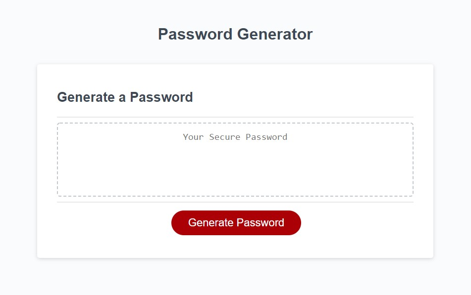
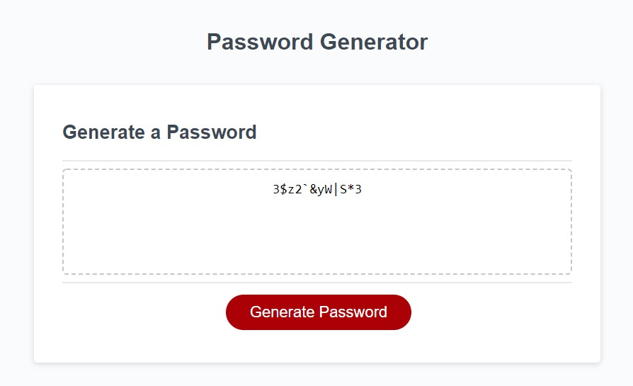
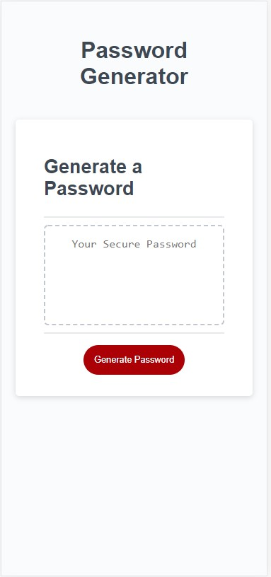
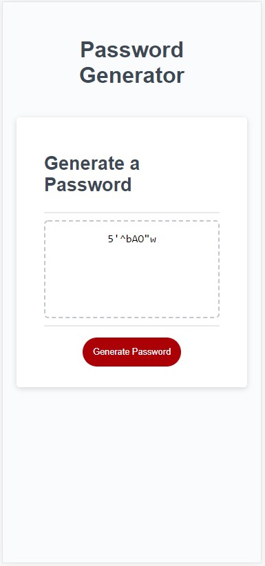

# Challenge Week 3 - Password Generator

## User Story

AS AN employee with access to sensitive data  
I WANT to randomly generate a password that meets certain criteria  
SO THAT I can create a strong password that provides greater security  

## Acceptance Criteria

GIVEN I need a new, secure password  
WHEN I click the button to generate a password  
THEN I am presented with a series of prompts for password criteria  
WHEN prompted for password criteria  
THEN I select which criteria to include in the password  
WHEN prompted for the length of the password  
THEN I choose a length of at least 8 characters and no more than 128 characters  
WHEN asked for character types to include in the password  
THEN I confirm whether or not to include lowercase, uppercase, numeric, and/or special characters  
WHEN I answer each prompt  
THEN my input should be validated and at least one character type should be selected  
WHEN all prompts are answered  
THEN a password is generated that matches the selected criteria  
WHEN the password is generated  
THEN the password is either displayed in an alert or written to the page  

## Screenshots

Desktop Main Screen  

Desktop Example Screen  

Mobile Main Screen  

Mobile Example Screen  

## Live Site
[Password Generator Live Site](https://joebarbone.github.io/challenge-w3-password-generator/)

## GitHub Repo
[Password Generator GitHub Repo](https://github.com/JoeBarbone/challenge-w3-password-generator)

---

## Extra Credit
In the real world, I'm not a huge fan of alert prompts to accept user input. This example requires a few minor changes to the source files. I added an input box instead of using alert prompts for the password length.

Checkboxes determine which character sets to use for password creation.

CSS changes were added to keep the look consistent with the existing site.

Alert boxes are still used for input validation errors such as password length violations and not selecting at least one character set.

## Extra Credit Live Site
[Extra Credit - PassGen Live Site](https://joebarbone.github.io/passgen/)

## Extra Credit GitHub Repo
[Password Generator GitHub Repo](https://github.com/JoeBarbone/passgen)
